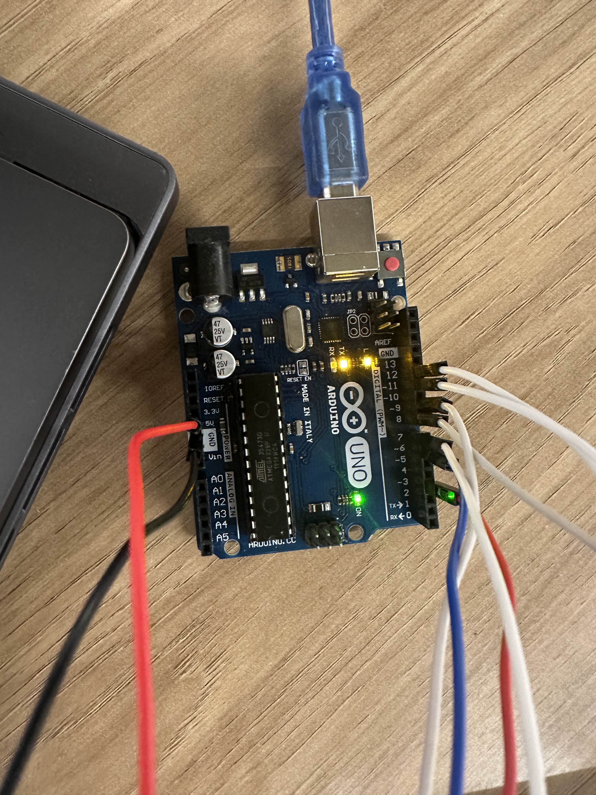

# Ponderada IOT
### Parte 1 
Nessa parte tivemos que fazer o led "built-in" do arduino piscar. Para isso utilizei o seguinte codigo:
``` 
void setup() {
  // put your setup code here, to run once:
  pinMode(10, OUTPUT);
}

void loop() {
  // put your main code here, to run repeatedly:
  digitalWrite(10, HIGH);  
  delay(500);                      
  digitalWrite(10, LOW);   
  delay(500);                      
}
```
Aqui esta a imagem do codigo no Arduino IDE e logo embaixo uma imagem do projeto com a luz no momento em que piscou: 


### Parte 2
A primeira etapa era fazer uma simulação no TinkerCad com uma montagem do pisca-pisca com Arduino Uno: 

[Link Para o TinkerCad](https://www.tinkercad.com/things/3zBGBH4CGx5/editel?sharecode=ddXuFrDDaOcI5fOJxKuq4ZYj2Wlr_dqNsPmPuoCqTLI)


O codigo utilizado foi:
```
void setup() {
  // put your setup code here, to run once:
  pinMode(10, OUTPUT);
}

void loop() {
  // put your main code here, to run repeatedly:
  digitalWrite(10, HIGH);  
  delay(500);                      
  digitalWrite(10, LOW);   
  delay(500);                      
}
```
Aqui está uma imagem dele fisíco e montado:


### Ir Além 
Para ir além e participar do campeonato da sala fiz um projeto que era um sensor de estacionamento com um sensor ultrassônico

Para fazer esse projeto foi utilizado:
- 1 Protoboard
- 1 Arduino UNO
- 1 Sensor Ultrassônico
- 4 LEDs
- 4 Resistores
- 1 buzzer
- 20 Jumpers

O codigo a seguir utilizado no projeto irá ler constantemente as informações do sensor ultrassônico e, de acordo com a distância medida pelo sensor, os LED’s irão acendendo de forma progressiva enquanto que o buzzer irá aumentando a frequência do tom.
Para que isso aconteça foram utilizadas as condições a seguir:

Se a distância estiver entre 30 cm e 20 cm, o LED 1 irá acender e o Buzzer irá apitar a uma frequência de 1500 Hz;

Se a distância estiver entre 20 cm e 10 cm, o LED 2 irá acender e o Buzzer irá apitar a uma frequência de 2000 Hz;

Se a distância estiver entre 10 cm e 5 cm, o LED 3 irá acender e o Buzzer irá apitar a uma frequência de 2750 Hz;

Se a distância estiver abaixo de 5 cm, o LED 4 irá acender e o Buzzer irá apitar a uma frequência de 3000 Hz;

E esse foi o código:
```
#define LED1 6
#define LED2 7
#define LED3 8
#define LED4 9
#define TRIGGER 11
#define ECHO 12
#define BUZZER 3
 
// Constantes utilizadas
const float som = 34300.0; // Velocidade do som em cm/s
const float limite1 = 30.0; // Limites de distância em cm
const float limite2 = 20.0;
const float limite3 = 10.0;
const float limite4 = 5.0;
 
void setup() {
 
// Inicie a comunicação Serial a 9600bps
Serial.begin(9600);
 
// Modo de entrada / saída do pino
pinMode(LED1, OUTPUT);
pinMode(LED2, OUTPUT);
pinMode(LED3, OUTPUT);
pinMode(LED4, OUTPUT);
pinMode(ECHO, INPUT);
pinMode(TRIGGER, OUTPUT);
pinMode(BUZZER, OUTPUT);
 
// Função que desliga os LEDs
desligarLEDs();
 
}
 
void loop() {
 
// Inicializa o sensor ultrassônico
inicializarTrigger();
 
// Obtenha a distância
float distancia = calcularDistancia ();
 
// Desligar os LEDs
desligarLEDs();
 
// Alerta se estiver dentro da zona de perigo
if (distancia < limite1){
// Dispara os alertas
alertas(distancia);
}
 
}
 
// Função de desligar os LEDs
void desligarLEDs()
{
digitalWrite(LED1, LOW);
digitalWrite(LED2, LOW);
digitalWrite(LED3, LOW);
digitalWrite(LED4, LOW);
}
 
// Verifique se algum alerta visual ou sonoro é necessário
void alertas (float distancia){
 
// Se a distância estiver entre o limite1 e o limite2
if (distancia < limite1 && distancia >= limite2){
 
// Ligue o LED 1
digitalWrite(LED1, HIGH);
tone(BUZZER, 1500, 50);
}
 
// Se a distância estiver entre o limite2 e o limite3
else if (distancia < limite2 && distancia >= limite3){
 
// Ligue o LED 2
digitalWrite(LED1, HIGH);
digitalWrite(LED2, HIGH);
tone(BUZZER, 2000, 100);
}
 
// Se a distância estiver entre o limite3 e o limite4
else if (distancia < limite3 && distancia >= limite4){
 
// Ligue o LED 3
digitalWrite(LED1, HIGH);
digitalWrite(LED2, HIGH);
digitalWrite(LED3, HIGH);
tone(BUZZER, 2750, 150);
}
 
// Se a distância for menor que o limite4
else if (distancia < limite4){
 
// Ligue o LED 4
digitalWrite(LED1, HIGH);
digitalWrite(LED2, HIGH);
digitalWrite(LED3, HIGH);
digitalWrite(LED4, HIGH);
tone(BUZZER, 3000, 200);
}
}
 
// Função usada para calcular a distância entre o som e o objeto
float calcularDistancia(){
unsigned long time = pulseIn(ECHO, HIGH);
float distancia = time* 0.000001 * som / 2.0;
Serial.print(distancia);
Serial.print("cm");
Serial.println();
delay(500);
return distancia;
}
 
// Função usada para inicializar o Trigger
void inicializarTrigger(){
digitalWrite(TRIGGER, LOW);
delayMicroseconds(2);
digitalWrite(TRIGGER, HIGH);
delayMicroseconds(10);
digitalWrite(TRIGGER, LOW);
}
```
A seguir tenho imagens do projeto montado:




[Link para o vídeo do ir além](ir_alem3.mov)

Fontes utilizadas: www.usinainfo.com.br 
